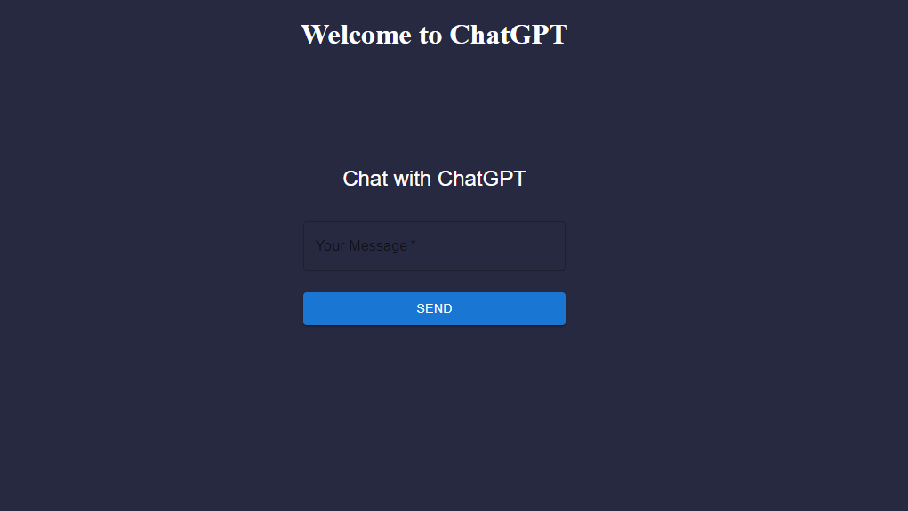

# GPT-ReactClone

## Description

Welcome to the ChatGPT Clone App! This application harnesses the power of state-of-the-art natural language processing to provide engaging and informative conversations.

Designed as a user-friendly chat interface, this clone offers a glimpse into the capabilities of advanced AI language models like GPT-3.5.

## Table of Contents:

- [Description](#Description)
- [The Challenge](#Challenge)
- [Screenshot](#screenshots)
- [Links](#links)

## Challenge

With your group, you’ll again conceive and execute a design that solves a real-world problem. In creating your first collaborative MERN-stack single-page application, you’ll combine a scalable MongoDB back end, a GraphQL API, and an Express.js and Node.js server with a React front end, implementing user authentication with JWT to build a user-focused platform. You’ll continue to build on the agile development methodologies you’ve used throughout this course. These include storing your project code in GitHub, managing your work with a project management tool, and implementing feature and bug fixes using the Git branch workflow and pull requests

## Screenshots

## Links

[Heroku](https://boiling-ocean-11327-1158f1eb9ac1.herokuapp.com)

[GitHub](https://github.com/Leonn24/GPT-ReactClone)
